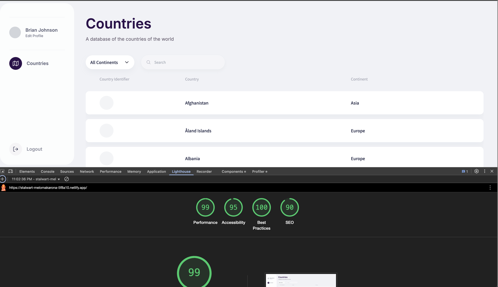
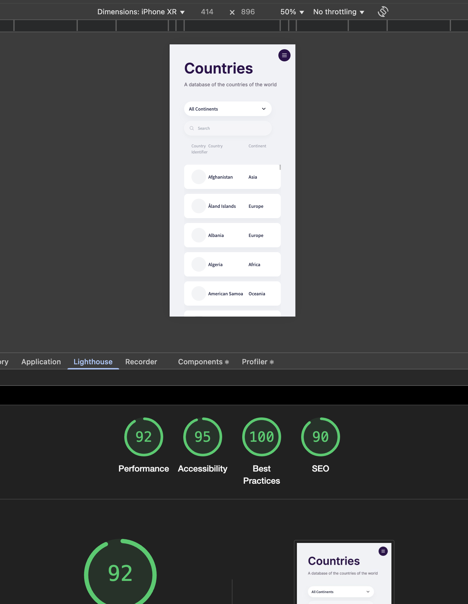

# Countries App

Learn all about the countries of the world.

## Author

Gautham Nookala  
gauthamnkl@gmail.com

## Live Demo

The application is deployed at: [https://stalwart-melomakarona-5f8a10.netlify.app/](https://stalwart-melomakarona-5f8a10.netlify.app/)

### Login Credentials

- Email address: user@example.com
- Password: password123

_Note: From time to time the API might return a Bad Gateway error due to possible rate limits. You will see a "Failed to fetch" error message. If this happens, please try again after a short while._

## Technologies Used

- React
- TypeScript
- Tailwind CSS
- Vite
- NPM

## How to Run

1. Install dependencies:

   ```
   npm install
   ```

2. Start development server:

   ```
   npm run dev
   ```

3. Build for production:

   ```
   npm run build
   ```

4. Preview production build:

   ```
   npm run preview
   ```

5. Follow the link that gets outputted in the terminal to open in browser

## Features

- Browse and search countries from around the world
- View detailed information about each country
- Basic authentication with router guard implementation
- Using best practices in web development
- Fetching only the fields we need to speed up load times
- Responsive design that works on desktop and mobile devices
- Clean, intuitive user interface

## Future Improvements

1. Add proper state management using Context API or Redux for shared state, authentication, and theming
2. Implement virtualization for long lists to improve performance
3. Create separate custom hooks for data fetching to improve code organization
4. Implement actual user authentication and account management
5. Clean up components to extract more common logic and keep them small
6. Refactor the data table to take keys/values and dynamically generate content as opposed to the current hardcoded nature
7. Extract SVGs into componentized icons for better maintainability and reusability
8. Add pagination for better navigation through large datasets
9. Improve error handling and add fallback UI
10. Enhance UX by remembering a country's position in the list when navigating back
11. Swap placeholder container for country identifier and user avatar
12. Implement SEO optimizations
13. Improve accessibility with better contrast ratios based on designer's input
14. Refine responsiveness based on specific mobile designs rather than assumptions
15. Add a custom 404 page

_Note: Given the time constraints and to avoid needless complexity for a technical assessment, a more straightforward approach was used in the current implementation._

## Performance Benchmarks

### Desktop



### Mobile


